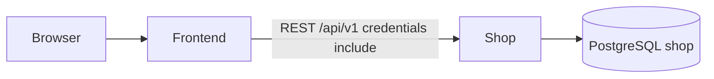

# REQ-001 Design — Clone Biệt Đội Săn Hàng storefront

## 1. Summary

Build a Vietnamese fishing-bait e-commerce storefront that reproduces the **public** page types and
customer flows of https://bietdoisanhang.vn/ (home, catalog, category, product, search, cart,
sign-in/register, news, policies, contact). Implementation is greenfield: one `shop-service`
(Spring Boot 4 + PostgreSQL) and one `frontend` (React + Mantine). Product data and copy are
synthetic; no copyrighted assets, credentials, or private data are copied from the reference site.

## 2. Scope

- In scope: public navigation and page types listed in REQ-001; catalog browse/search/detail;
  add-to-cart with quantity; guest + signed-in cart; register / sign-in / sign-out; news list/detail;
  seven information pages; contact display + validated contact form (no email send); REST APIs;
  Flyway schema + seed; unit/slice/integration tests; FE component tests; Docker Compose;
  Playwright specs for browse → detail → cart and account flows.
- Out of scope: payment gateway, shipping provider, warehouse/ERP/accounting, live chat/SMS/email
  providers, admin CMS, wishlist, social posting, exact Haravan backend, pixel-perfect CSS clone,
  copying brand logos/photos/article prose.

## 3. Functional Requirements

| ID | Requirement | Source |
|----|-------------|--------|
| FR-1 | Home shows header, primary nav, featured/best-seller products, bait and gear sections, news teaser, footer, search and cart entry points | REQ-001 §2, AC-001..003 |
| FR-2 | Visitors browse all products and products by category; cards show name, image, price (VND); cards open detail | REQ-001 §3, AC-005..008 |
| FR-3 | Product detail shows name, images, price, description, information, usage (when present), category, related products, quantity stepper, add-to-cart | REQ-001 §4, AC-009..012 |
| FR-4 | Keyword search returns matching products; zero matches shows an empty state | REQ-001 §6, AC-013..015 |
| FR-5 | Cart supports add, change quantity, remove, subtotal, total quantity, total price, continue shopping, proceed to checkout | REQ-001 §5, AC-016..021 |
| FR-6 | Guest cart is kept via `cart_token` cookie; after sign-in, guest lines merge into the user cart | REQ-001 AC-022 |
| FR-7 | Visitor can register (email, password, display name); validation errors are 400; duplicate email is 409 | REQ-001 §7, AC-023..024 |
| FR-8 | Registered user can sign in (200 + session cookie), bad credentials are 401, signed-in user can sign out (204) | REQ-001 §7, AC-025..027 |
| FR-9 | Header/nav shows Đăng nhập / Đăng ký when signed out, and display name + Đăng xuất when signed in | REQ-001 §7 |
| FR-10 | News listing and article detail (title, body, optional image); next/prev or list navigation | REQ-001 §8, AC-028..030 |
| FR-11 | Static pages: about, contact, shipping, privacy, warranty/return, terms, shopping guide | REQ-001 §9, AC-031..037 |
| FR-12 | Contact page shows configurable hotline, email, Zalo URL and a validated message form that returns 202 without sending mail | REQ-001 §11 |
| FR-13 | Checkout page shows cart summary and a “contact to complete order” CTA (no payment) | REQ-001 §5 proceed to checkout; out-of-scope payment |
| FR-14 | Layout adapts at desktop (≥1024), tablet (768–1023), mobile (<768): burger nav, stacked grids | REQ-001 §10, AC-004 |

## 4. Non-functional Requirements

| ID | Category | Requirement (measurable) |
|----|----------|--------------------------|
| NFR-1 | Usability | Every route uses themed Mantine `AppShell` + `MantineProvider` (ADR-0006 teal/Inter). No native inputs/buttons as product controls. |
| NFR-2 | Performance | Home and catalog: ≤2 catalog/news GETs on first paint; product images `loading="lazy"`; listing p95 handler < 200 ms locally (Testcontainers). |
| NFR-3 | Security | Passwords stored only as BCrypt hashes; session token hashed at rest; never log passwords/tokens; APIs validate with Jakarta Validation; RFC 9457 errors; no stack traces. |
| NFR-4 | Compatibility | Usable in current Chromium and Safari at 1280, 768, and 375 CSS px. |
| NFR-5 | Reliability | `GET /actuator/health` 200 when DB is up; Flyway on startup; `ddl-auto=validate`. |
| NFR-6 | Operability | `docker compose up --build` starts PostgreSQL, `shop-service`, and `frontend`; home HTTP 200. |
| NFR-7 | Quality | Each BE task has JUnit slice/service tests; catalog/cart/auth have `@DataJpaTest` or Testcontainers; FE ACs have RTL tests; Playwright covers browse, detail, cart, account. |
| NFR-8 | Content | Seed uses placeholder images (`/placeholders/product.svg` or `placehold.co`) and original short Vietnamese copy, not scraped reference assets. |

## 5. Architecture

Greenfield. No product components are registered today. ADR-0007 adds `shop-service` and `frontend`.

| Component | Path | Responsibility |
|-----------|------|----------------|
| `shop-service` | `product/services/shop-service` | REST, JPA, Flyway, session cookie, cart cookie |
| `frontend` | `product/frontend` | AppShell storefront, TanStack Query, Vite proxy `/api` → `:18081` |
| PostgreSQL | Compose service | One database `shop` |

Package `com.product.shop` with `api` / `service` / `domain` / `repository` / `config` per
`docs/standards/backend.md`. No Spring Cloud. Default `server.port: ${SERVER_PORT:18081}`.

Cookie model:

- `shop_session` — httpOnly, SameSite=Lax, Path=/, opaque token (64-byte hex), 7-day expiry; raw
  value is never stored (SHA-256 of token only).
- `cart_token` — httpOnly, SameSite=Lax, Path=/, UUID for guests; reused after sign-in until merge.

## 6. API Changes

Base: `/api/v1`. JSON. Errors: RFC 9457 `ProblemDetail`.

| Method | Path | Request | Response | Errors |
|--------|------|---------|----------|--------|
| GET | `/categories` | — | Tree: `{ id, slug, name, parentId, children[] }` | — |
| GET | `/categories/{slug}` | — | One category | 404 |
| GET | `/products` | `category`, `q`, `featured`, `sort=name\|price`, `order=asc\|desc`, `page` (1), `size` (24, max 60) | `{ items: ProductCard[], page, size, total }` | 400 |
| GET | `/products/{slug}` | — | `ProductDetail` + `related[8]` same category excluding self | 404 |
| GET | `/articles` | `page`, `size` | `{ items: ArticleCard[], page, size, total }` | 400 |
| GET | `/articles/{slug}` | — | `{ slug, title, excerpt, content, imageUrl, publishedAt, prevSlug, nextSlug }` | 404 |
| GET | `/pages/{slug}` | slugs in §7 | `{ slug, title, body }` | 404 |
| GET | `/shop/settings` | — | `{ shopName, hotline, email, zaloUrl, freeShipFromVnd }` from env | — |
| POST | `/contact` | `{ name, email, phone, message }` all `@NotBlank` + size caps | 202 `{ accepted: true }` | 400 |
| POST | `/auth/register` | `{ email, password, displayName }` | 201 `User` + `Set-Cookie shop_session` | 400, 409 |
| POST | `/auth/login` | `{ email, password }` | 200 `User` + cookie; merges guest cart | 400, 401 |
| POST | `/auth/logout` | cookie | 204, clear cookie | — |
| GET | `/auth/me` | cookie | 200 `User` | 401 |
| GET | `/cart` | cookies | `Cart` | — (empty cart is 200) |
| POST | `/cart/items` | `{ productId, quantity }` quantity 1–99 | 200 `Cart` + maybe `cart_token` | 400, 404 |
| PATCH | `/cart/items/{productId}` | `{ quantity }` 1–99 | 200 `Cart` | 400, 404 |
| DELETE | `/cart/items/{productId}` | — | 200 `Cart` | 404 |

`ProductCard`: `{ id, slug, name, priceVnd, imageUrl, categorySlug, categoryName }`.
`ProductDetail`: card fields + `{ description, information, usage, images[{url,alt}], category }`.
`User`: `{ id, email, displayName }` — never `passwordHash`.
`Cart`: `{ items[{ productId, slug, name, imageUrl, unitPriceVnd, quantity, lineTotalVnd }], totalQuantity, totalPriceVnd }`.
Money is integer VND. `lineTotalVnd = unitPriceVnd * quantity`. Totals are sums of lines.

Public GETs are unauthenticated. Cart and `/auth/me` use cookies. Register/login set the session
cookie. CORS allows the Vite origin with `allowCredentials`.

## 7. Data Model Changes

New schema (Flyway `V1__init.sql`). No existing tables.

| Table | Columns |
|-------|---------|
| `users` | `id` UUID PK, `email` UNIQUE, `password_hash`, `display_name`, `created_at` |
| `sessions` | `id` UUID PK, `user_id` FK, `token_hash` UNIQUE, `expires_at` |
| `categories` | `id` UUID PK, `slug` UNIQUE, `name`, `parent_id` FK nullable, `sort_order` |
| `products` | `id` UUID PK, `slug` UNIQUE, `name`, `price_vnd` INT, `description` TEXT, `information` TEXT, `usage` TEXT, `category_id` FK, `featured` BOOL, `created_at` |
| `product_images` | `id` UUID PK, `product_id` FK, `url`, `alt`, `sort_order` |
| `articles` | `id` UUID PK, `slug` UNIQUE, `title`, `excerpt`, `content` TEXT, `image_url`, `published_at` |
| `pages` | `id` UUID PK, `slug` UNIQUE, `title`, `body` TEXT |
| `carts` | `id` UUID PK, `user_id` FK nullable UNIQUE, `token` UUID nullable UNIQUE, `updated_at` |
| `cart_items` | `id` UUID PK, `cart_id` FK, `product_id` FK, `quantity` INT, UNIQUE(`cart_id`,`product_id`) |

Indexes: `products(category_id)`, `products(name)`, `sessions(expires_at)`, `articles(published_at DESC)`.
Search: case-insensitive `name` / `description` contains (`q` max 80 chars).

**Seed (`V2__seed.sql`)** — original short Vietnamese blurbs, placeholder images:

Categories (parent → children), slugs aligned with the public sitemap:

- `moi-cau-ca` → `cau-ca-ro-phi`, `cau-ca-chep`, `cau-ca-diec`, `cau-ca-tram-co`, `cau-ca-tram-den`, `huong-lieu-du-ca`, `moi-cau-ca-cac-loai`
- `phu-kien-do-cau` → `can-cau-ca`, `theo-cau-ca`, `truc-cau-ca`, `phao-cau-ca`, `phu-kien-khac`

≥16 products across those categories; ≥4 `featured=true` for home “bán chạy”. ≥2 articles. Pages:

| slug | Title |
|------|-------|
| `about` | Giới thiệu |
| `contact` | Liên hệ |
| `shipping` | Chính sách vận chuyển và kiểm hàng |
| `privacy` | Chính sách bảo mật |
| `warranty` | Chính sách bảo hành và đổi trả |
| `terms` | Điều khoản dịch vụ |
| `shopping-guide` | Hướng dẫn mua hàng |

Settings (env, not DB): `SHOP_NAME` default `Mồi Câu Shop`, `SHOP_HOTLINE` default `0123 456 789`,
`SHOP_EMAIL` default `shop@example.com`, `SHOP_ZALO_URL` default `https://zalo.me/0123456789`,
`SHOP_FREE_SHIP_FROM_VND` default `200000`. Do not bake the reference site’s real contacts into seed.

## 8. Dependencies

- Internal: TASK-002 before FE catalog; TASK-003 before FE news/pages; TASK-004 before FE account;
  TASK-005 before FE cart; TASK-001 and TASK-006 before Compose.
- External: Java 21, Spring Boot 4.0.x, Spring Security crypto (BCrypt) + web, PostgreSQL, Flyway,
  React, Mantine, TanStack Query, React Router, Playwright. No new UI kit. No JWT library (opaque
  session rows). No payment SDK.

## 9. Risks

| Risk | Impact | Likelihood | Mitigation |
|------|--------|------------|------------|
| Copying copyrighted photos/prose | Legal | Medium | Seed placeholders + original short copy only; FE uses Tabler icons, not scraped logos |
| Password / session leak | Account takeover | Medium | BCrypt; hashed session tokens; httpOnly cookies; no secrets in logs or `VITE_*` |
| Guest cart loss on sign-in | Wrong totals | Medium | Merge by `product_id` (sum qty, cap 99); tests for merge |
| Reference site changes | Design drift | Low | Design is locked to public IA observed 2026-09-24, not live scraping |
| Docker/Testcontainers unavailable | Tests/deploy fail | Medium | Note FAILED vs skip; Compose is a DEVOPS AC |
| Over-scoped first tasks | Review churn | Medium | One role, one repo, <400 lines per task |

## 10. Assumptions

- **Greenfield:** `project.md` registry has no components. Implementing roles create `shop-service`
  and `frontend` via `/repo`.
- ADR-0005 (`task-service`) is superseded and is not a starting point.
- UX is **equivalent**, not a pixel clone: Mantine teal theme, not Haravan CSS.
- App name **Mồi Câu Shop** — do not use the reference trademark or logo files.
- Single SKU per product (no combo/variant picker). Quantity 1–99.
- Wishlist and “sản phẩm vừa xem” are omitted.
- Checkout is a summary page + contact CTA; no order table and no payment in v1.
- Contact form is accept-only (202); no mail provider.
- UI language: Vietnamese labels matching the public IA (Trang chủ, Sản phẩm, Tin tức, …).
- Sort and pagination on catalog are in scope (observed on `/collections/all`).
- Guest may use cart; account is optional except that signed-in nav must work.
- TEST black-box runs happen after MERGED; this design still requires automated tests on each branch.

## 11. Open Questions

| # | Question | Blocking? | Answer |
|---|----------|-----------|--------|
| — | none | — | Design is FINAL |

## 12. Task Breakdown

| Task | Title | Assignee | Covers | Depends on |
|------|-------|----------|--------|------------|
| TASK-001 | Bootstrap shop-service | BE | NFR-5 | — |
| TASK-002 | Catalog and search APIs + seed | BE | FR-2, FR-3, FR-4, NFR-2 | TASK-001 |
| TASK-003 | News and static page APIs + seed | BE | FR-10, FR-11 | TASK-001 |
| TASK-004 | Customer account APIs | BE | FR-7, FR-8, NFR-3 | TASK-001 |
| TASK-005 | Cart APIs and guest merge | BE | FR-5, FR-6 | TASK-002, TASK-004 |
| TASK-006 | Frontend scaffold and AppShell | FE | NFR-1, FR-14 (shell) | — |
| TASK-007 | Home, catalog, category, search UI | FE | FR-1, FR-2, FR-4, FR-14 | TASK-002, TASK-006 |
| TASK-008 | Product detail UI | FE | FR-3 | TASK-002, TASK-006 |
| TASK-009 | Cart and checkout UI | FE | FR-5, FR-6, FR-13 | TASK-005, TASK-006 |
| TASK-010 | Account UI | FE | FR-7, FR-8, FR-9 | TASK-004, TASK-006 |
| TASK-011 | News, policies, contact UI | FE | FR-10, FR-11, FR-12 | TASK-003, TASK-006 |
| TASK-012 | Docker Compose local stack | DEVOPS | NFR-6 | TASK-001, TASK-006 |
| TASK-013 | Playwright critical flows | FE | NFR-7 (e2e) | TASK-007, TASK-008, TASK-009, TASK-010 |

## 13. UI / UX

Kit: ADR-0006 (`MantineProvider`, `Notifications`, Tabler, Inter). Theme: `docs/standards/frontend.md`
(`primaryColor: "teal"`). Shell content `maw={1280}` (storefront, not 720).

**Shell (`AppShellLayout`)**

- `AppShell` header height 64: `Burger` (hidden `sm+`), `Anchor` shop name, `NavLink` group
  (Trang chủ, Sản phẩm mega via `Menu`/`HoverCard` with category tree, Tin tức, Liên hệ),
  `ActionIcon` `IconSearch` aria-label “Tìm kiếm”, `Indicator`+`ActionIcon` `IconShoppingCart`
  aria-label “Giỏ hàng” (label = `totalQuantity`), account cluster (below).
- Header second row (desktop): `Text` hotline + free-ship hint from `/shop/settings`.
- Navbar (mobile): same links in `Stack`; overlay drawer.
- Footer: three `SimpleGrid` columns — Liên kết (home, about, products, news, contact),
  Hướng dẫn (shopping-guide + policies), Hỗ trợ (`Anchor` tel / mail / Zalo). `Button`
  floating `ActionIcon`s for phone and Zalo (`pos="fixed"` bottom-right).
- Signed out: `Button` variant light “Đăng nhập” → `/signin`, `Button` “Đăng ký” → `/register`.
- Signed in: `Text` displayName + `Button` subtle “Đăng xuất”.

**Screens**

| Route | Purpose | Primary actions |
|-------|---------|-----------------|
| `/` | Home | Browse sections, open product/news |
| `/products` | All products | Sort, paginate, open product |
| `/categories/:slug` | Category listing | Same as catalog |
| `/products/:slug` | Detail | Qty, add to cart, related |
| `/search?q=` | Search results | Revise query, open product |
| `/cart` | Cart | Qty, remove, continue, checkout |
| `/checkout` | Checkout stub | Go to contact |
| `/signin` | Sign in | Submit, link to register |
| `/register` | Register | Submit, link to login |
| `/news` | Article list | Open article |
| `/news/:slug` | Article | Prev/next or back to list |
| `/pages/:slug` | Policy/about | Footer/nav only |
| `/contact` | Contact | Submit form |

**Per screen (Mantine)**

- **Home:** `Carousel` or `SimpleGrid` of 3 `Image` hero placeholders; trust `SimpleGrid` of 4
  `Paper`+`ThemeIcon`; section `Title` + `SimpleGrid` cols `{base:2, sm:3, md:4}` of product `Card`
  (`Image`, `Text` name, `Text` `fw={700}` price, `Card` clickable); news `Card` with `Badge`;
  loading = `Skeleton` cards; error = `Alert` color red.
- **Product card (shared):** `Card withBorder shadow="sm"`; empty image = `ThemeIcon` `IconPhoto`.
- **Catalog / category / search:** `Breadcrumbs`; `Title`; `Group` with `Select` sort
  (Tên A–Z / Z–A / Giá tăng / Giá giảm); `SimpleGrid` of cards; `Pagination`; empty search =
  `ThemeIcon` `IconSearchOff` + “Không tìm thấy sản phẩm” + `Button` về trang sản phẩm.
- **Detail:** `Grid` image `Carousel` + `Stack` (`Title`, `Text` price, `Breadcrumbs` category,
  `NumberInput` min 1 max 99 hideControls=false label “Số lượng”, `Button` filled “Thêm vào giỏ”
  `IconShoppingCart`); `Tabs` “Thông tin sản phẩm” (description/information/usage `Typography` via
  `Text` paragraphs — **no** `dangerouslySetInnerHTML`); related `Title` + card grid. Add success =
  `notifications.show`. Loading = `Skeleton` + `Loader`.
- **Cart:** `Table` (or stacked `Card` on mobile): image, name, unit price, `NumberInput` qty,
  line total, `ActionIcon` `IconTrash` opens `Modal` confirm; summary `Paper` totals; `Button`
  “Tiếp tục mua sắm” → `/products`; `Button` “Thanh toán” → `/checkout`. Empty: `IconBasketOff` +
  CTA. Loading skeletons.
- **Checkout:** `Paper` reprint of totals; `Alert` color teal: thanh toán cổng thanh toán chưa có
  trong phiên bản này; `Button` “Liên hệ để hoàn tất” → `/contact`.
- **Login / Register:** centered `Paper maw={420}` `TextInput` email, `PasswordInput`, register
  also `TextInput` displayName; `Button` submit; field errors from ProblemDetail; 401/409 `Alert`.
- **News list:** `SimpleGrid` `Card` image/title/excerpt. **Detail:** `Title`, `Image`, `Text` body,
  `Group` prev/next `Anchor`.
- **Pages:** `Title` + `TypographyStylesProvider` **only if body is plain text / Markdown rendered
  to React** (prefer `Text` paragraphs from API string split). No HTML from the reference site.
- **Contact:** settings `Stack` + form `TextInput` name/email/phone, `Textarea` message, `Button`
  “Gửi”; 202 → notification; do not claim email was sent.

**Responsive:** `SimpleGrid` breakpoints above; header `Burger` + `AppShell.navbar` below `sm`;
cart table becomes `Stack` of cards below `sm`.
