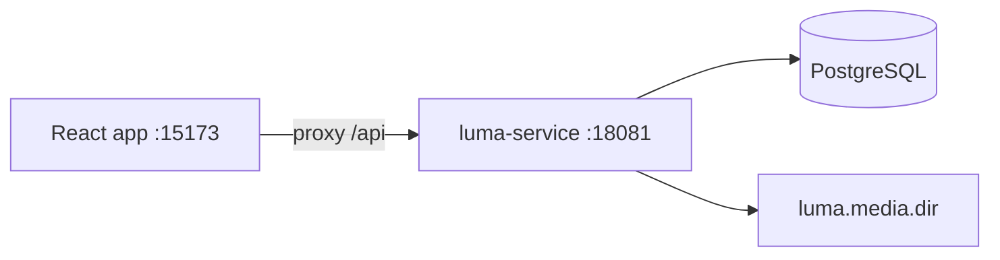

# REQ-001 Design — Luma photo social

## 1. Summary

Build **Luma**, a local Instagram-like photo social: members sign up and stay signed in for the
browser session, browse a newest-first photo feed, publish a photo with a caption, like or unlike
posts, and open public profiles. One Spring service (`luma-service`) owns members, sessions, posts,
likes, and stored images. One React app implements a sellable consumer UI from the UX/UI contract
(TASK-001), not a CRUD/admin layout.

## 2. Scope

- In scope: email + password sign-up / sign-in / sign-out; browser-session cookie; public home
  feed; create post (HTTPS image URL or uploaded file); like / unlike; public profile grid; empty /
  loading / error states; seeded demo members and posts; local DEV only.
- Out of scope: stories, Reels / video, DMs, comments, hashtags, explore ranking, ads, follow,
  notifications, live, shopping, native apps, multi-tenant SaaS, PROD release.

## 3. Functional Requirements

| ID | Requirement | Source |
|----|-------------|--------|
| FR-1 | A visitor can sign up with email, password (≥8 characters), and username (3–30: `[a-zA-Z0-9_]`); a new member row is stored and a session cookie is set. Duplicate email or username returns 409 with a distinct, user-visible reason. | REQ-001 AC-001 |
| FR-2 | Sign-in with a matching email + password returns the member and sets the same session cookie. Unknown email or wrong password returns 401 with one generic message and does not create a session. | REQ-001 AC-002 |
| FR-3 | `GET /api/v1/auth/me` with a valid session cookie returns the current member. Reload in the same browser keeps the cookie. Sign-out expires the cookie; later `me` is 401. | REQ-001 AC-003 |
| FR-4 | `GET /api/v1/posts` (public) returns recent posts newest-first. Each item includes image URL, caption, author username + avatar URL, like count, and `likedByMe` (false when anonymous). | REQ-001 AC-004 |
| FR-5 | A signed-in member can create a post: caption 1–2200 characters plus either an HTTPS image URL or an uploaded `image/jpeg`, `image/png`, or `image/webp` file ≤ 8 MiB. The new post is first in the feed. | REQ-001 AC-005 |
| FR-6 | Like is idempotent `PUT`; unlike is idempotent `DELETE`. For the current member, liked state toggles and `likeCount` changes by exactly one (0 floor; no double-count). Anonymous callers get 401. | REQ-001 AC-006 |
| FR-7 | `GET /api/v1/profiles/{username}` returns username, avatar URL, bio, post count. `GET .../posts` returns that author's posts newest-first. Unknown username is 404. Zero posts is an empty list, not an error. | REQ-001 AC-007 |
| FR-8 | First migrate + seed inserts ≥2 demo members and ≥6 posts so a fresh local feed is non-empty before any visitor posts. | REQ-001 AC-008 |
| FR-9 | Uploaded files are stored under `luma.media.dir` and served at `GET /api/v1/media/{id}`. HTTPS URLs are stored as-is (API does not fetch remote bytes). | REQ-001 Constraints |

## 4. Non-functional Requirements

| ID | Category | Requirement (measurable) |
|----|----------|--------------------------|
| NFR-1 | Security | Passwords stored only as BCrypt hashes; never returned in JSON. Session cookie `LUMA_SESSION` is `HttpOnly`, `Path=/`, `SameSite=Lax`. No `Secure` on local HTTP. |
| NFR-2 | Security | Session required for create-post and like/unlike. Feed, profiles, media, and sign-up/sign-in are reachable without a session. |
| NFR-3 | Security | CORS allowlist is exactly `http://localhost:15173` and `http://127.0.0.1:15173` with `allowCredentials=true`. Credentialed POST from either origin succeeds. |
| NFR-4 | Reliability | Errors use RFC 9457 `ProblemDetail` (`type`, `title`, `status`, `detail`). No stack traces in responses. |
| NFR-5 | Performance | `GET /api/v1/posts?limit=20` p95 < 500 ms on local DEV with ≤100 seeded rows. |
| NFR-6 | UX | FE never shows a blank page or a raw unthemed form dump for empty, loading, or error; states match TASK-001. |
| NFR-7 | Operability | Service listens on `SERVER_PORT` (default 18081). `GET /actuator/health` is 200 when the process is up. Local DEV only; no PROD deploy. |
| NFR-8 | Integrity | Image URL on create must be `https://` (reject `http://` and non-URL). File upload rejects other MIME types and bodies > 8 MiB with 400. |

## 5. Architecture

One backend component, one frontend component (ADR-0004). Browser talks to the API through the
Vite `/api` proxy (or directly in tests).

| Component | Responsibility |
|-----------|----------------|
| `luma-service` | Members, session authentication, posts, likes, media, seed. Package-by-feature: `auth`, `member`, `post`, `like`, `media`, `shared`. |
| `frontend` | Consumer SPA: routes, kit theme from UX tokens, TanStack Query against `/api/v1`. |
| PostgreSQL | Single schema for `luma-service`. |
| Local disk | Uploaded image bytes; not a CDN. |

### Stack (ADR-0009)

Locked: Java 21 + Spring · React. SA names everything else.

| Layer | Choice | Why |
|-------|--------|-----|
| BE runtime | Java 21 + Spring Boot 4.0 | locked core; ADR-0003 |
| BE API | REST JSON `/api/v1` | ADR-0003 default |
| BE data | PostgreSQL 16 + Flyway + Spring Data JPA (`ddl-auto=validate`) | default; one DB per service |
| BE security | Spring Security; servlet session cookie `LUMA_SESSION`; BCrypt | REQ wants browser-session stay-signed-in, not JWT |
| BE media | Local filesystem + `ResourceHttpRequestHandler` | no third-party CDN |
| BE test | JUnit 5, `@WebMvcTest`, Testcontainers PostgreSQL | `project.md` |
| FE runtime | React + Vite + TypeScript | locked core + default bundler |
| FE UI kit | Mantine (`@mantine/core`, `@mantine/hooks`, `@mantine/notifications`) + Tabler Icons + `@fontsource-variable/inter` | themed, accessible primitives; UX/UI tokens override kit defaults so the app is photo-first, not admin |
| FE data | TanStack Query | cache feed, like toggles, `me` |
| FE router | React Router | SPA routes in §13 |
| FE test | Vitest + Testing Library; Playwright for e2e | `project.md` |
| FE layout | `src/{app,pages,features,shared}` | ADR-0009 |

Base package: `com.product.luma`. First BE task creates `product/services/luma-service` via
`/repo create luma-service be`. First FE task creates `product/frontend` via `/repo create frontend fe`.

## 6. API Changes

All JSON. Dates ISO-8601 UTC. IDs UUID strings. Member payloads never include password.

| Method | Path / Interface | Request | Response | Errors |
|--------|------------------|---------|----------|--------|
| POST | `/api/v1/auth/sign-up` | `{ email, password, username }` | 201 `{ id, email, username, avatarUrl, bio }` + `Set-Cookie` | 400 validation; 409 `email_taken` / `username_taken` |
| POST | `/api/v1/auth/sign-in` | `{ email, password }` | 200 same member + `Set-Cookie` | 401 `invalid_credentials` (same body for unknown email and bad password) |
| POST | `/api/v1/auth/sign-out` | — | 204 + expire cookie | — |
| GET | `/api/v1/auth/me` | cookie | 200 member | 401 |
| GET | `/api/v1/posts` | `limit` (default 20, max 50), `before` (post id cursor) | 200 `{ items: PostCard[], nextBefore }` newest first | 400 bad query |
| POST | `/api/v1/posts` | `multipart/form-data`: `caption` + (`image` file XOR `imageUrl`) | 201 `PostCard` | 400; 401 |
| GET | `/api/v1/posts/{id}` | — | 200 `PostCard` | 404 |
| PUT | `/api/v1/posts/{id}/likes` | cookie | 200 `{ likeCount, likedByMe: true }` | 401; 404 |
| DELETE | `/api/v1/posts/{id}/likes` | cookie | 200 `{ likeCount, likedByMe: false }` | 401; 404 |
| GET | `/api/v1/profiles/{username}` | — | 200 `{ username, avatarUrl, bio, postCount }` | 404 |
| GET | `/api/v1/profiles/{username}/posts` | `limit`, `before` | 200 `{ items: PostCard[], nextBefore }` | 404 if user missing; empty `items` if no posts |
| GET | `/api/v1/media/{id}` | — | 200 image bytes + `Content-Type` | 404 |
| GET | `/actuator/health` | — | 200 `{ status: "UP" }` | — |

`PostCard`: `{ id, caption, imageUrl, createdAt, author: { username, avatarUrl }, likeCount, likedByMe }`.

## 7. Data Model Changes

New schema (Flyway `V1__init.sql`). No existing tables.

| Table | Fields | Notes |
|-------|--------|-------|
| `members` | `id` UUID PK, `email` unique not null, `password_hash` not null, `username` unique not null, `avatar_url` text, `bio` varchar(160), `created_at` timestamptz | Email stored lowercased |
| `posts` | `id` UUID PK, `author_id` FK members, `caption` varchar(2200) not null, `image_url` text not null, `created_at` timestamptz | Index `(created_at DESC, id DESC)` |
| `likes` | `post_id` FK, `member_id` FK, `created_at` timestamptz, PK `(post_id, member_id)` | Unique pair prevents double-like |
| `media` | `id` UUID PK, `storage_path` text, `content_type` varchar(64), `byte_size` bigint, `created_at` timestamptz | Rows only for uploads |

Seed (`R__seed_demo.sql` or a Flyway version after V1): ≥2 members (documented password
`demo-pass-8`), ≥6 posts with stable HTTPS images (e.g. picsum.photos). Idempotent on re-run.

Backward compatibility: none (greenfield).

## 8. Dependencies

- Internal: TASK-001 (UX/UI contract) before any FE implementation. TASK-002 before TASK-003
  (same service). TASK-004 depends on TASK-001 + TASK-002. TASK-005 depends on TASK-001 +
  TASK-003 + TASK-004. UX/UI and BE may run in parallel.
- External: PostgreSQL (local / Testcontainers), Maven Central, npm. No new messaging, cache, or
  Cloud. Kit and DB are named in §5 (Mantine already documented historically in ADR-0006;
  PostgreSQL is the ADR-0009 default) — no new ADR.

## 9. Risks

| Risk | Impact | Likelihood | Mitigation |
|------|--------|------------|------------|
| Kit-default Mantine looks like admin CRUD | Product fails sellable bar | Medium | UX/UI tokens + photo-first density; FE MAJOR if it ships unthemed kit defaults |
| File upload + local disk in ephemeral env | Images vanish across rebuilds | Medium | Seed uses HTTPS URLs; uploads documented as DEV-only |
| Fetching caller-supplied image URLs | SSRF | High if fetched | Store HTTPS URL as-is; do not server-side fetch |
| Session + CORS mismatch (`localhost` vs `127.0.0.1`) | Credentialed POST 403 | High on this machine | NFR-3; tests hit both origins |
| Docker down | Testcontainers fail | Medium | Note in Implementation; do not skip silently |

## 10. Assumptions

- Username is required at sign-up (REQ lists email + password; profiles need a handle).
- Avatar and bio are optional; seed fills them; missing avatar uses a deterministic placeholder URL
  agreed in the UX spec.
- "Stay signed in" means a session cookie that survives reload until the browser is closed — no
  "remember me" persistent cookie.
- Public feed and public profiles are readable without a session (REQ constraint).
- One service is enough; no API gateway.
- Demo seed password `demo-pass-8` is a fixture, not a secret.

## 11. Open Questions

| # | Question | Blocking? | Answer |
|---|----------|-----------|--------|
| 1 | Should members edit avatar/bio after sign-up? | No | Out of this REQ; seed + optional empty fields only. |

## 12. Task Breakdown

| Task | Title | Assignee | Covers | Depends on |
|------|-------|----------|--------|------------|
| TASK-001 | Luma UX/UI design contract | UX/UI | NFR-6, §13 screens | — |
| TASK-002 | luma-service: members and session | BE | FR-1, FR-2, FR-3, NFR-1, NFR-3, NFR-4, NFR-7 | — |
| TASK-003 | luma-service: posts, likes, profiles, seed | BE | FR-4, FR-5, FR-6, FR-7, FR-8, FR-9, NFR-2, NFR-5, NFR-8 | TASK-002 |
| TASK-004 | Frontend: shell, sign-up, sign-in, sign-out | FE | FR-1, FR-2, FR-3, NFR-6 | TASK-001, TASK-002 |
| TASK-005 | Frontend: feed, create post, like, profile | FE | FR-4, FR-5, FR-6, FR-7, FR-8, NFR-6 | TASK-001, TASK-003, TASK-004 |

## 13. UI / UX

SA constraints only. Visual contract is TASK-001 (`docs/design/ux/REQ-001-ux.md` + Figma).

**Screens**

| Route | Purpose | Primary actions | Data / API |
|-------|---------|-----------------|------------|
| `/` | Public entry / marketing splash when signed out; if session exists, redirect to `/feed` | Go to sign-up, sign-in | `GET /auth/me` |
| `/sign-up` | Create an account | Submit email, password, username | `POST /auth/sign-up` |
| `/sign-in` | Return to an existing account | Submit email, password | `POST /auth/sign-in` |
| `/feed` | Home feed of recent photos (default after sign-in; also browsable signed-out) | Scroll, like/unlike (signed-in), open profile, open create | `GET /posts`, `PUT/DELETE /posts/{id}/likes` |
| `/create` | Compose a photo post (signed-in only; else redirect `/sign-in`) | Pick file or paste HTTPS URL, caption, publish | `POST /posts` |
| `/u/:username` | Public profile: identity + post grid | Open a post, back to feed | `GET /profiles/{username}`, `GET .../posts` |

**Constraints**

- UI kit is **Mantine + Tabler + Inter** (§5). No second kit. Map UX/UI tokens onto `MantineProvider`;
  do not ship default admin gray / stacked CRUD forms.
- Photo-first hierarchy (Instagram-class density): image dominates; caption and like sit below;
  profile grid is square tiles.
- Navigation: persistent app chrome (bottom nav on mobile, side nav on desktop ≥1024).
- i18n: English copy only for this REQ.
- Auth: session cookie via credentialed `fetch`; no token in `localStorage`.
- Legally fixed copy: product name **Luma**; generic 401 detail `Invalid email or password.`
- Every screen specifies loading, empty, error, and success in the UX spec (NFR-6).

**UX/UI task:** TASK-001. Every FE task sets `requires_uxui: true` and `depends_on` includes TASK-001.
