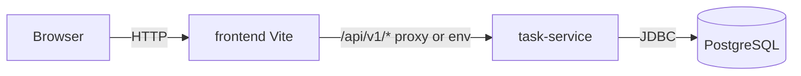

# REQ-001 Design — Simple Task Management App

## 1. Summary

Deliver a single-user task management web app: a new `task-service` (Spring Boot 4, PostgreSQL, Flyway)
exposes versioned REST JSON APIs for CRUD and status changes; a new `frontend` React app lists, filters,
and edits tasks via TanStack Query. No authentication in v1. DEVOPS adds Docker Compose to build and run
the stack locally. Tests live in the BE and FE implementation tasks, not separate TEST assignee tasks.

## 2. Scope
- In scope: task list/create/edit/delete; TODO/COMPLETED status; filter ALL/TODO/COMPLETED; persistence;
  REST API; web UI; BE unit/integration tests; FE component tests; Docker build/run with PostgreSQL.
- Out of scope: auth, users, notifications, WebSocket, pagination, mobile apps (per requirement).

## 3. Functional Requirements
| ID | Requirement | Source |
|----|-------------|--------|
| FR-1 | List all tasks via API and UI | REQ-001 Scope; AC view list |
| FR-2 | Create task with required title, optional description; default status TODO | REQ-001 AC create, title, description, TODO default |
| FR-3 | Reject create/update when title is blank | REQ-001 AC empty title |
| FR-4 | Edit task title and description | REQ-001 Scope edit |
| FR-5 | Delete task; deleted task absent from list | REQ-001 Scope delete; AC deleted |
| FR-6 | Mark task COMPLETED or revert to TODO | REQ-001 Scope completion |
| FR-7 | Filter tasks by ALL, TODO, or COMPLETED | REQ-001 Scope filter |
| FR-8 | Persist create/update/delete in PostgreSQL | REQ-001 AC persistence |
| FR-9 | API returns appropriate HTTP status for success and errors (400 validation, 404 missing) | REQ-001 AC HTTP codes, not-found |
| FR-10 | Backend tests cover main business and API flows | REQ-001 AC backend tests |
| FR-11 | Frontend tests cover main user interactions | REQ-001 AC frontend tests |
| FR-12 | Application buildable and runnable via Docker with PostgreSQL | REQ-001 AC Docker; Deployment |

## 4. Non-functional Requirements
| ID | Category | Requirement (measurable) |
|----|----------|--------------------------|
| NFR-1 | Performance | `GET /api/v1/tasks` with ≤1000 rows returns 200 in <500 ms p95 on local Docker stack |
| NFR-2 | Security | No auth in v1; title/description bounded (`@Size`); errors use ProblemDetail without stack traces |
| NFR-3 | Reliability | Task data survives service restart when PostgreSQL volume is retained |
| NFR-4 | Maintainability | API paths `/api/v1/...`; schema via Flyway only; DTO records, no entity leakage |
| NFR-5 | Compatibility | Task table uses surrogate `id`; no hard-coded single-user assumptions in API paths (future auth can add `user_id`) |
| NFR-6 | Usability | Task UI uses the ADR-0006 kit (Mantine AppShell, themed controls, toasts). Browser-default inputs/buttons or a CSS-only white page do not meet this NFR |

## 5. Architecture

Greenfield product: register `task-service` and `frontend` per ADR-0005 when repos are created.



| Component | Responsibility |
|-----------|----------------|
| `task-service` | Task domain, REST API, Flyway migrations, actuator health |
| `frontend` | Task UI, API client, TanStack Query |
| PostgreSQL | Durable task storage (one DB for task-service) |
| Docker Compose | Build images, wire env (DB URL, ports), documented run path |

Interactions: browser loads static FE; FE calls relative `/api/v1/tasks...`; dev proxy targets `BACKEND_PORT`
(default 18082 for this service). Compose publishes FE and API ports for smoke checks.

## 6. API Changes

Base path: `/api/v1/tasks` (JSON). Status enum: `TODO`, `COMPLETED`.

| Method | Path / Interface | Request | Response | Errors |
|--------|------------------|---------|----------|--------|
| GET | `/api/v1/tasks` | Query `status` optional: omit or `ALL` = all; `TODO` \| `COMPLETED` filters | 200 `[TaskResponse]` | 400 invalid `status` |
| GET | `/api/v1/tasks/{id}` | — | 200 `TaskResponse` | 404 |
| POST | `/api/v1/tasks` | `{ "title": string, "description": string? }` | 201 `TaskResponse` | 400 blank/too long title or description |
| PUT | `/api/v1/tasks/{id}` | `{ "title": string, "description": string? }` | 200 `TaskResponse` | 400 validation; 404 |
| PATCH | `/api/v1/tasks/{id}/status` | `{ "status": "TODO" \| "COMPLETED" }` | 200 `TaskResponse` | 400 invalid status; 404 |
| DELETE | `/api/v1/tasks/{id}` | — | 204 empty | 404 |

`TaskResponse` record:

```json
{
  "id": "uuid-or-long",
  "title": "string",
  "description": "string | null",
  "status": "TODO | COMPLETED",
  "createdAt": "ISO-8601",
  "updatedAt": "ISO-8601"
}
```

Use `UUID` primary key in DB and JSON string id for extension-friendly keys.

## 7. Data Model Changes

**Table `task`** (Flyway `V1__init.sql`):

| Column | Type | Notes |
|--------|------|--------|
| id | UUID PK | generated |
| title | VARCHAR(255) NOT NULL | |
| description | TEXT NULL | |
| status | VARCHAR(20) NOT NULL | check TODO/COMPLETED |
| created_at | TIMESTAMPTZ NOT NULL | |
| updated_at | TIMESTAMPTZ NOT NULL | |

Index on `(status)` for filter queries. No `user_id` in v1; migration `V2__add_user_id` reserved for future auth.

Backward compatibility: n/a (new service).

## 8. Dependencies
- Internal: TASK-004 depends on TASK-003 API contract; TASK-005 depends on TASK-003; TASK-006 depends on TASK-004 and TASK-005.
- External: PostgreSQL (existing stack choice ADR-0003); Spring Boot 4, Flyway, React/Vite (ADR-0003);
  Mantine UI kit (ADR-0006).

## 9. Risks
| Risk | Impact | Likelihood | Mitigation |
|------|--------|------------|------------|
| Unbounded task list without pagination | Slow UI/API at scale | Medium (out of scope v1) | Document limit; NFR-1 targets small datasets only |
| No auth exposes API to anyone on network | Data visible/modifiable | High if exposed publicly | Document local/dev use; ADR notes future auth |
| Docker port conflicts on developer machines | Compose fails to start | Medium | Configurable `SERVER_PORT` / compose env |
| FE/backend URL mismatch in Docker | UI cannot reach API | Medium | Single compose env for API base URL and proxy |

## 10. Assumptions
- No product components exist yet (`project.md` registry empty); implementers create `task-service` and
  `frontend` repos via the repo skill (ADR-0005).
- REST paths use `/api/v1/tasks` rather than the requirement’s `/api/tasks` example (backend standard).
- Title max 255 characters; description max 2000 characters (validation aligned with `@Size`).
- Default local ports: `task-service` 18082, frontend dev 15173; Compose maps host ports via env with documented defaults.
- Status filter `ALL` is represented by omitting the query param or explicit `status=ALL` (both accepted).
- Integration tests use Testcontainers PostgreSQL when Docker is available.

## 11. Open Questions
| # | Question | Blocking? | Answer |
|---|----------|-----------|--------|
| — | None | — | — |

## 12. Task Breakdown
| Task | Title | Assignee | Covers | Depends on |
|------|-------|----------|--------|------------|
| TASK-003 | Task service REST API and persistence | BE | FR-1–FR-10, NFR-1–NFR-5 | — |
| TASK-004 | Task management web UI | FE | FR-1–FR-7, FR-11, NFR-2, NFR-6 | TASK-003 |
| TASK-005 | task-service Docker and database compose | DEVOPS | FR-12, NFR-3 | TASK-003 |
| TASK-006 | Frontend Docker and full-stack compose | DEVOPS | FR-12, NFR-3 | TASK-004, TASK-005 |

## 13. UI / UX

Kit: ADR-0006 (Mantine + Tabler Icons + Inter). One screen: task list.

| Area | Spec |
|------|------|
| Shell | `AppShell` header “Tasks”; optional subtitle “Personal task list”; main `maw={720}` |
| Create | `Card` titled “Add task”: `TextInput` Title (required), `Textarea` Description, primary `Button` Create (`IconPlus`) |
| Filter | `SegmentedControl` All / Todo / Completed above the list |
| List | Each task is a `Card`/`Paper`: title, optional description, `Badge` for status, `Group` of actions |
| Actions | Edit (`IconPencil`), toggle complete (`IconCircleCheck` / `IconCircle`), Delete (`IconTrash`, red subtle). Delete opens `Modal` confirm |
| Loading | 3 `Skeleton` rows |
| Empty | `ThemeIcon` + “No tasks yet” + dimmed hint to use Add task |
| Error | `Alert` color red, `role="alert"` |
| Feedback | `notifications.show` on create / save / delete / status change success; mutation errors also `Alert` or red notification |

Do not ship native `<input>`/`<button>` as the product UI.
